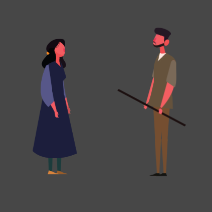
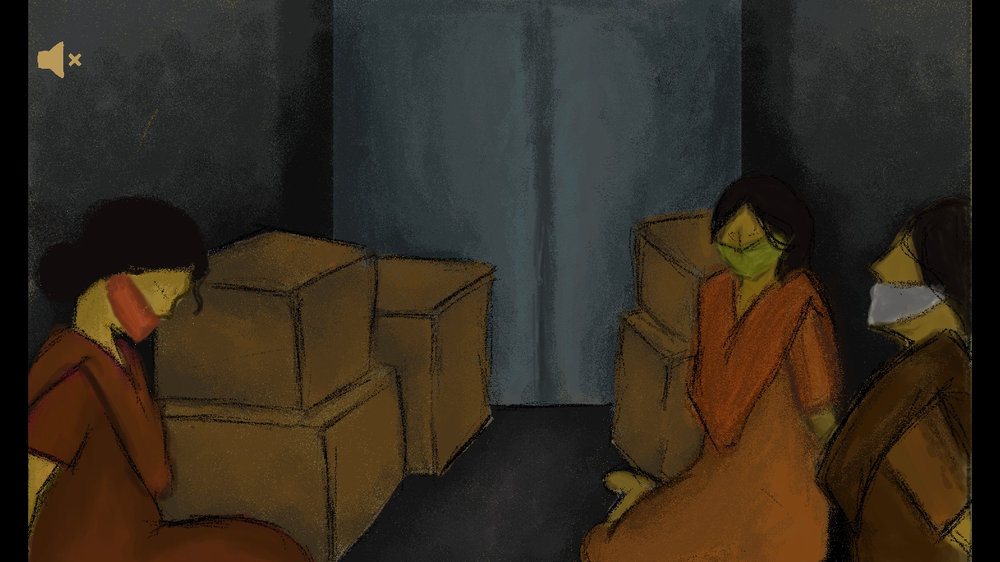
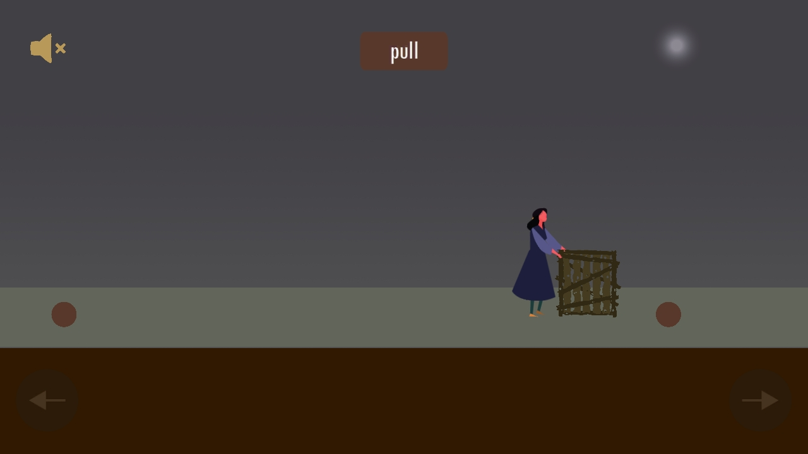
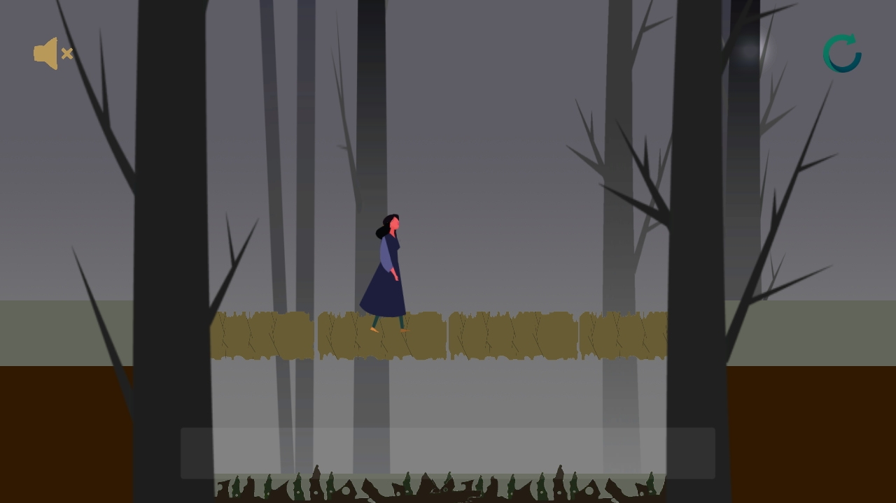
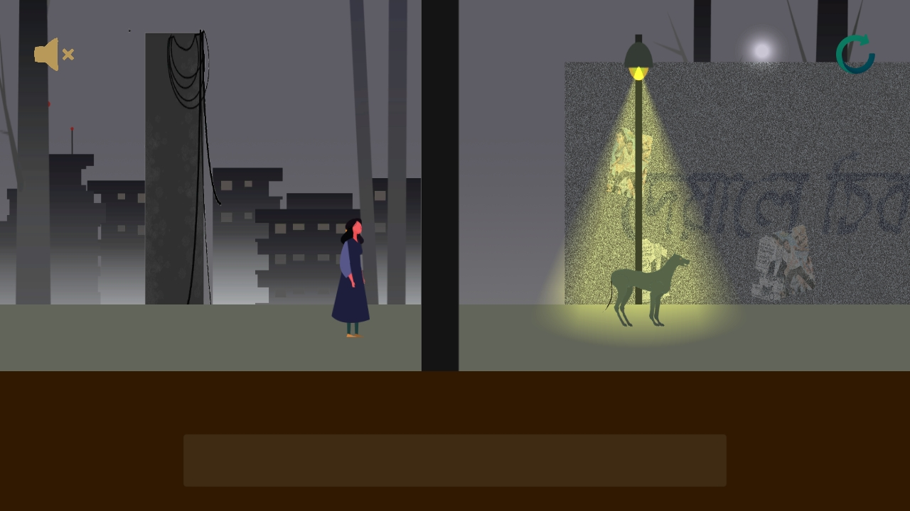

# Shikha

  

# Introduction
**Shikha** is a 2d game built with Unity game engine. The game is about a village girl who was caught by some kidnappers. To guide the girl to the police station is the objective of the game.

## Story
At the start of the game we will see that, the girl is locked in a van along with some other girls. But at some point the door of van breaks and the girl starts to run away. After the story ends, there will be a tutorial showing how to control the character. And after that the main gameplay will begin. The player will have to solve some simple puzzle to get to the police station. After the girl reaches the police station, she will inform about the kidnapping to police and the game will end.  
The game has two levels.

# Platforms
The game was mainly built targetting the android platform. But a build for windows has also been made.
**App Link Android**: [https://drive.google.com/file/d/1Nu69t_q3SHqXUWiPsfQDex6wuahkjwML/view?usp=sharing](https://drive.google.com/file/d/1Nu69t_q3SHqXUWiPsfQDex6wuahkjwML/view?usp=sharing)  
**App Link Windows**: [https://drive.google.com/file/d/1fCZAy9Fg-DWryngXuLjdbwvsKa7CCPvE/view?usp=sharing](https://drive.google.com/file/d/1fCZAy9Fg-DWryngXuLjdbwvsKa7CCPvE/view?usp=sharing)

## Windows key bindings
-  Press w-d to move forwards-backwards.
-  Press space to jump.
-  Hold e for grabbing a box. Then press w-d to pull-push the box.
-  Hold c for crouching.

# Screenshots

Story  

Tutorial  

Level 1 gameplay  

Level 2 gameplay  

